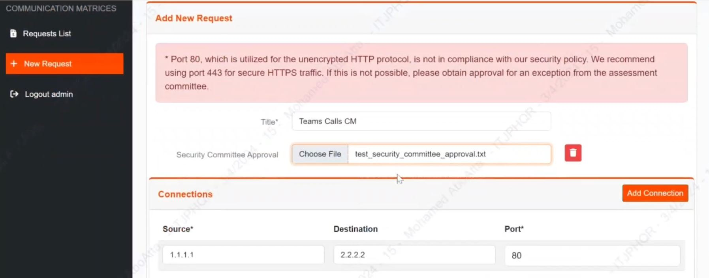

[![LinkedIn][linkedin-shield]][linkedin-url]

<!-- PROJECT LOGO -->
 

    
  <h3 align="center">AutoSec - AI Security Assist for Zero Trust Network Access</h3>

<!-- TABLE OF CONTENTS -->

  
Table of Contents

  <ol>
    <li>
      <a href="#about-the-project">About The Project</a>
      <ul>
        <li><a href="#business-case">Business Case</a></li>
        <li><a href="#technical-solution">Technical Solution</a></li>
        <li><a href="#tech-stack">Tech Stack</a></li>
      </ul>
    </li>
    <li><a href="#achievements">Achievements</a></li>
    <li><a href="#contact">Contact</a></li>
  </ol>

<!-- ABOUT THE PROJECT -->
## About The Project

* **Project Name:** AutoSec - AI Security Assist for Zero Trust Network Access  
* **Version:** v1.0.0  
* **Department:** Technology

---

### Business Case

In a Zero Trust Network environment, ensuring secure access and configuration management is critical. **AutoSec** addresses this by streamlining and automating security configuration tasks, providing centralized access verification, and enabling seamless communication between data collection, verification, and change management processes.

This solution supports the **SPDA security team** by automating data collection and access verification, enhancing the speed and accuracy of security configurations across nodes like firewalls. The project is designed to increase operational efficiency while maintaining robust security compliance.

(<a href="#readme-top">back to top</a>)

### Technical Solution

The **AutoSec** platform utilizes AI to facilitate automated security configuration and verification in a zero-trust environment. The primary functionalities include:
* **Data Collection**: Automates the gathering of security-related data.
* **Access Verification**: Provides a streamlined, automated process for the SPDA team to verify access requests before any changes are made.
* **Configuration Management**: Automates and logs all changes applied by security admins on nodes such as firewalls and ensures proper documentation of every configuration update.

(<a href="#readme-top">back to top</a>)

### Tech Stack

This project was developed using the following tech stack:

* **Python** (for backend automation and AI integration)
* **Django** (for web application framework)
* **JavaScript** and **Bootstrap** (for frontend)

(<a href="#readme-top">back to top</a>)

<!-- ACHIEVEMENTS -->
## Achievements

Our project earned the **1st Place Award** at the Egypt level Hackathon and advanced to the **Semi-Finals in the Africa-Level Hackathon Competition**. The AutoSec solution, praised for its innovative approach to zero-trust security, was celebrated as a model in AI-driven security.

(<a href="#readme-top">back to top</a>)

<!-- CONTACT -->
## Contact

Mohamed AbdelGawad Ibrahim - [@m-abdelgawad](https://www.linkedin.com/in/m-abdelgawad/) - <a href="tel:+201069052620">+201069052620</a>

(<a href="#readme-top">back to top</a>)

<!-- MARKDOWN LINKS & IMAGES -->
[linkedin-shield]: https://img.shields.io/badge/-LinkedIn-black.svg?style=for-the-badge&logo=linkedin&colorB=555
[linkedin-url]: https://www.linkedin.com/in/m-abdelgawad/
